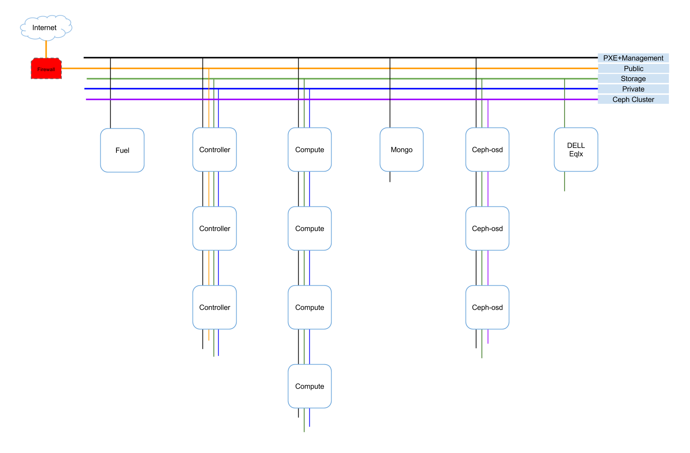

# 网络架构

## 网络架构图

EayunStack网络架构下图所示，共有五个逻辑网络，分别是：

* PXE+Management Network：承载Fuel PXE网络流量及OpenStack管理网络流量。
* Storage Network：承载存储网络流量。
* Private Network：承载虚拟机间通信网络流量。
* Public Network：承载虚拟机与外部网络通信网络流量。
* Ceph Cluster Network：承载Ceph节点间数据同步网络流量。

