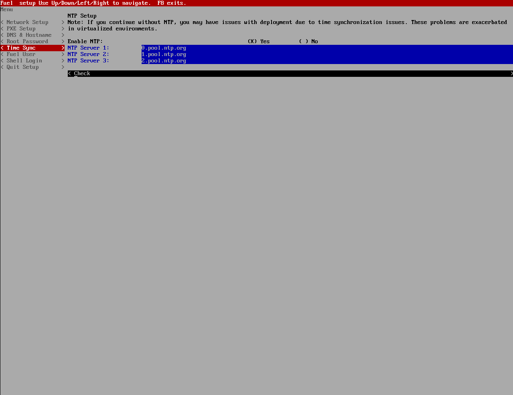

# 初始化配置

基本系统安装完成后，还需要做一些初始化配置。

## 网络配置

* 根据网络规划配置Fuel节点网络参数，如下图所示。

 

## PXE配置

* 使用Fuel节点部署OpenStack节点时，所有OpenStack节点通过PXE网络安装，此处可以对Fuel节点进行PXE服务配置，如下图所示。

>  **注意：**
>
>  **DHCP Pool End** 处预留4个可用IP，用于后续监控平台的部署。

 

## DNS及主机名配置

* 根据实际环境需求配置Fuel节点的DNS服务器及主机名，如下图所示。

 

## 系统root用户密码配置

> ###### 注意
> 此处如不设置root用户密码，root用户默认密码为“r00tme"

* 设置root用户密码，如下图所示。

 

## NTP服务器配置

> ###### 注意
> * OpenStack环境中各个节点间时间必须是同步的，在Fuel部署的OpenStack环境中所有节点都将Fuel节点设置为NTP服务器进行时间同步，因此Fuel上的NTP服务必须配置正确！
> * NTP服务必须与上级时间源进行时间同步后才能向客户端提供NTP服务！因此此处指定的NTP服务器必须可用！

* 配置公网中的NTP服务器地址，如下图所示。

 

## Fuel admin用户密码配置

* 此处可设置Fuel WEB管理界面admin用户密码，如下图所示。

 

## Shell登录

* 此处可切换到系统命令行，如下图所示。

 

## 退出

* 保存配置并退出登录

 

> ###### 注意
> 完成以上配置并退出后，系统会根据用户所配置的参数对Fuel环境进行初始化，该过程是自动完成的，不需要人为干预。

## 部署完成

* Fuel节点部署完成后会自动重启，系统重启后可看到如下界面。

 

## 修改root用户密码

> ###### 注意
> Fuel节点可以通过SSH密钥对验证方式登录后续部署的所有OpenStack节点，因此，对Fuel节点root帐号的进行加固是一项非常重要的工作。在Fuel节点部署完成后，管理员需要登录到Fuel节点，修改root帐号密码。

 

