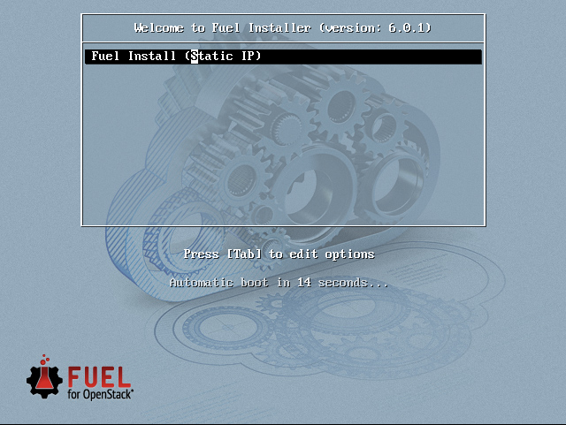
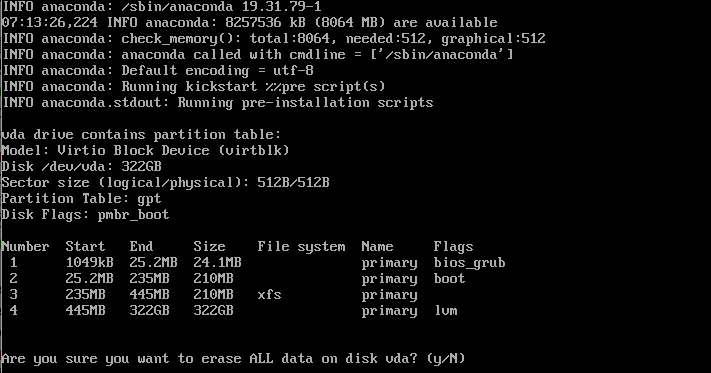

# 安装基本系统

## 启动服务器

* 启动Fuel节点，进入BIOS设置界面，将服务器引导顺序中第一引导项设置为光驱。
* 将前面步骤中准备的光盘放入光驱中，重启服务器。

## 安装基本系统

* 服务器从光驱启动后，可以看到下图所示界面，不需要做任何修改，直接按回车键即可开始基本系统的安装，整个安装过程是自动化完成的，中间不需要任何干预。

 

> ###### 注意
> 如果服务器上的磁盘中已经存在文件系统，安装过程中会有如下图所示的提示，确认是否可以清除磁盘上的所有数据，如果确认，输入 ```y``` 后回车继续。

 

> 如果以上操作无法清除磁盘上已存在的文件系统导致安装失败，可以登陆到已存在的系统中，执行以下命令手动清除磁盘上已经存在的文件系统。

```
[root@localhost ~]# lsblk 
NAME                                                                                     MAJ:MIN RM   SIZE RO TYPE MOUNTPOINT
sda                                                                                        8:0    0 465.8G  0 disk 
├─sda1                                                                                     8:1    0  1000M  0 part /boot
└─sda2                                                                                     8:2    0 464.8G  0 part 
  ├─fedora-root                                                                          253:0    0  97.7G  0 lvm  /
  ├─fedora-swap                                                                          253:1    0   7.8G  0 lvm  [SWAP]
  └─fedora-home                                                                          253:2    0 359.3G  0 lvm  /home
[root@localhost ~]# dd if=/dev/zero of=/dev/sda bs=1M count=100
```

> ###### 注意
> 系统安装完成后，请将关盘从光驱中取出
