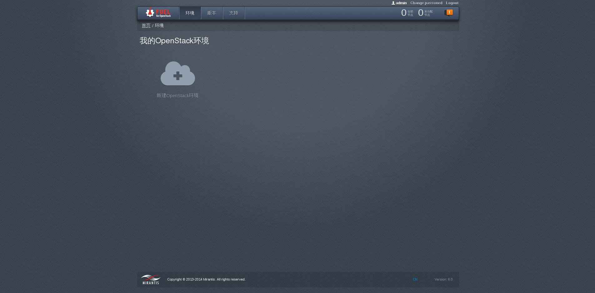
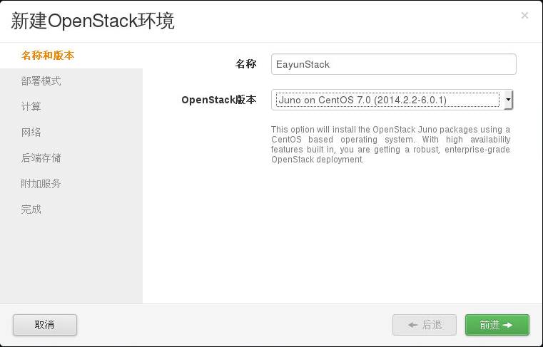
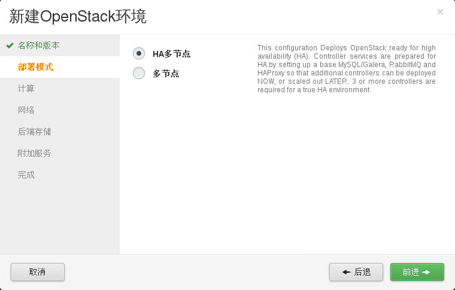
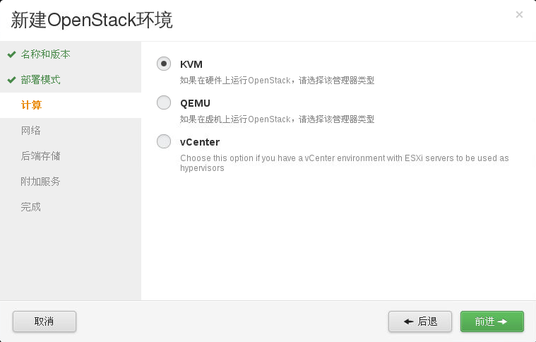
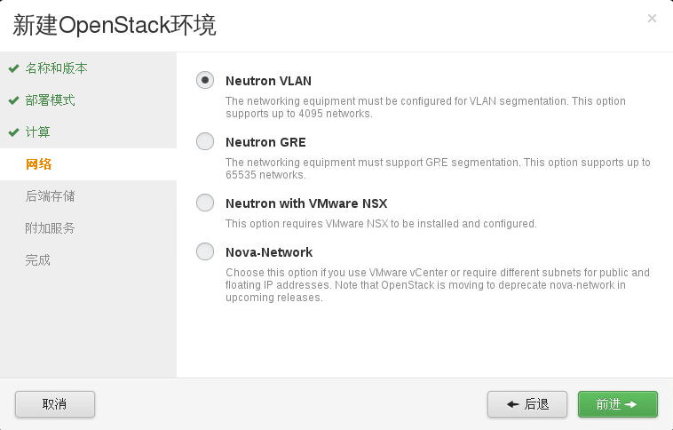
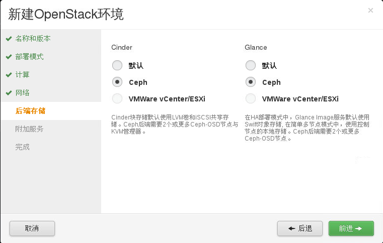
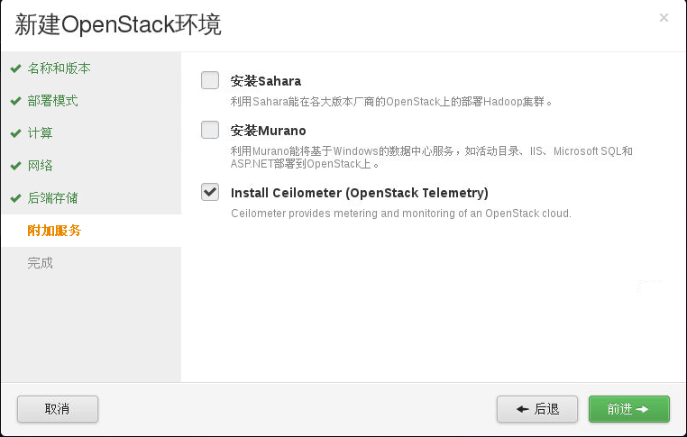

# 创建OpenStack环境

下面要创建一个新的OpenStack环境，创建过程中需要做如下配置。

## 新建OpenStack环境

* 点击**新建OpenStack环境**，创建一个新的OpenStack环境，如下图所示。

 

## 设置名称和版本

* 设置新环境的名称及新环境中要安装的OpenStack的版本及底层操作系统的发行版，如下图所示。

 

## 设置部署模式

* 本次部署的环境中需要实现Controller节点的HA，因此选择“HA多节点”，如下图所示。

 

## 设置底层Hypervisor

* 使用KVM作为底层Hypervisior，如下图所示。

 

## 设置网络

* 使用Neutron VLAN承载虚拟机网络，如下图所示。

 

## 设置后端存储

* Cinder、Glance两个组件均使用Ceph作为后端存储，如下图所示。

 

## 设置附加服务

* 选择附加安装的组件，EayunStack环境需要附加安装Ceilometer，如下图所示。

 

## 完成

* 完成配置，点击**新建**按钮，如下图所示。

 
