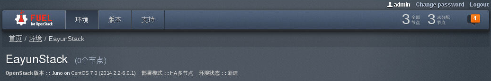
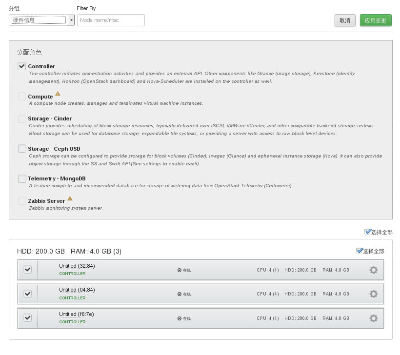
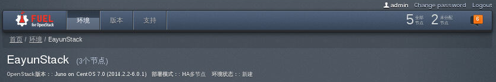
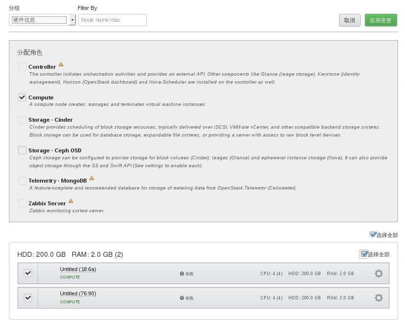
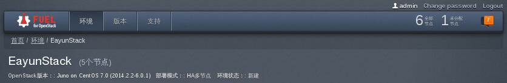
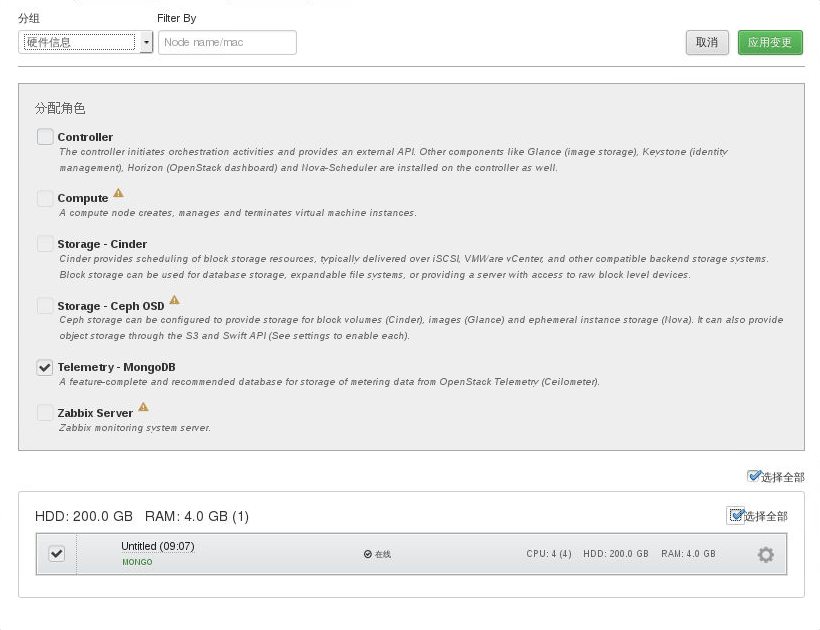
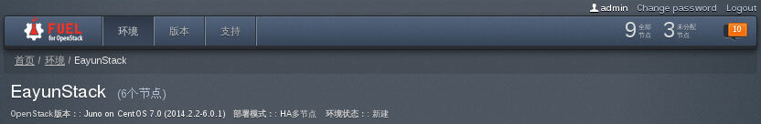
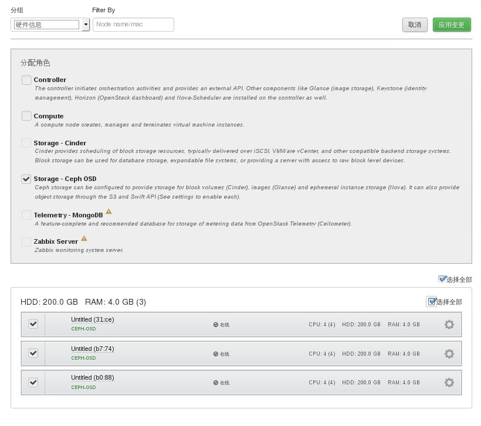
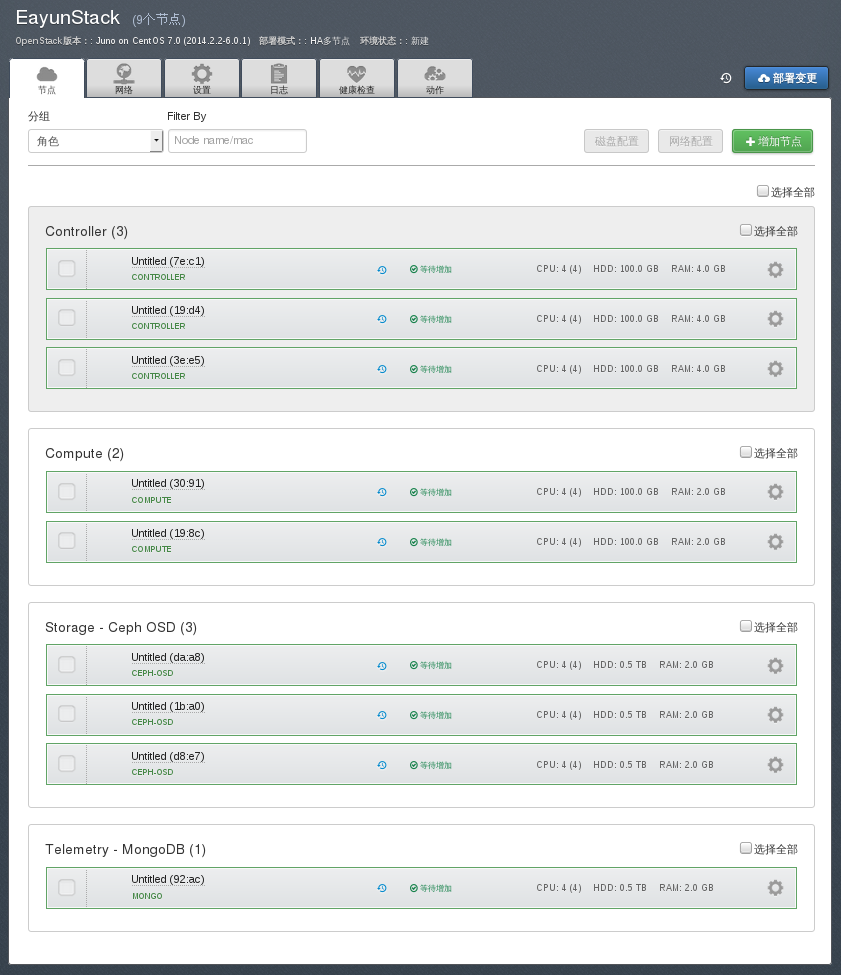

# 发现及增加节点

Fuel节点在部署节点前，首先需要发现节点，方法如下。

## Controller节点

* 发现节点

 * 启动**基本环境搭建**中规划的所有**Controller节点**，进入BIOS，设置引导顺序中第一引导项为网卡启动，启动服务器。

* 增加节点

 * 等待所有**Controller节点**启动完成后，在Fuel节点可看到发现新节点提示，如下图右上角所示。

   

 * 切换到**节点**页面，点击**增加节点**按钮，“分配角色“中选中“Controller”选项，勾选下面发现的所有节点，点击**应用变更**按钮。

   

## Compute节点

* 发现节点

 * 启动**基本环境搭建**中规划的所有**Compute节点**，进入BIOS，设置引导顺序中第一引导项为网卡启动，启动服务器。

*  增加节点

 * 等待所有**Compute节点**启动完成后，在Fuel节点可看到发现新节点提示，如下图所示。

    

 * 切换到**节点**页面，点击**增加节点**按钮，“分配角色“中选中“Compute”选项，勾选下面发现的所有节点，点击**应用变更**按钮。

    

## Mongo节点
* 发现节点

 * 启动**基本环境搭建**中规划的所有**Mongo节点**，进入BIOS，设置引导顺序中第一引导项为网卡启动，启动服务器。

*  增加节点

 * 等待所有**Mongo节点**启动完成后，在Fuel节点可看到发现新节点提示，如下图所示。

    

 * 切换到**节点**页面，点击**增加节点**按钮，“分配角色“中选中“Telemetry-MongoDB”选项，勾选下面发现的所有节点，点击**应用变更**按钮。

    

## Ceph-osd节点

* 发现节点

 * 启动**基本环境搭建**中规划的所有**Ceph-osd节点**，进入BIOS，设置引导顺序中第一引导项为网卡启动，启动服务器。

*  增加节点

 * 等待所有**Ceph-osd节点**启动完成后，在Fuel节点可看到发现新节点提示，如下图所示。

    

 * 切换到**节点**页面，点击**增加节点**按钮，“分配角色“中选中“Storage-Ceph OSD”选项，勾选下面发现的所有节点，点击**应用变更**按钮。

    

## 完成

* 所有节点增加完成后，切换到**节点**界面，可以看到如下图所示内容。

    

