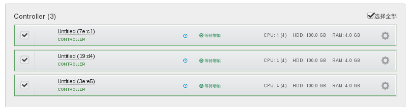
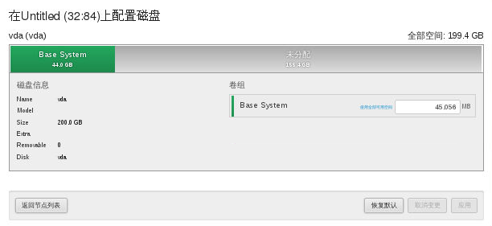
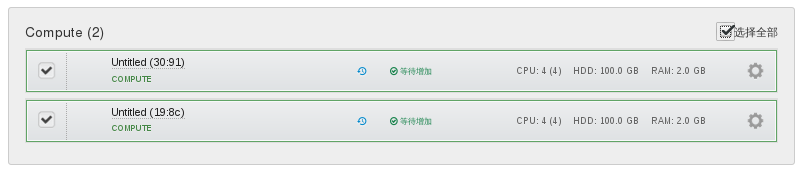
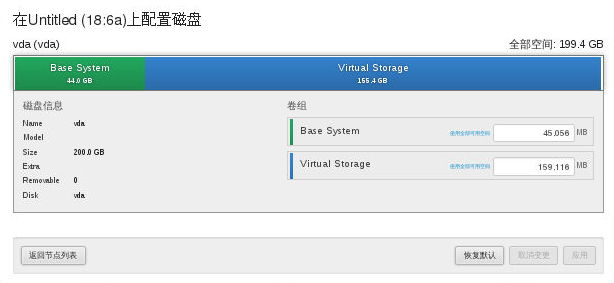
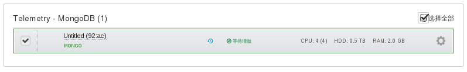
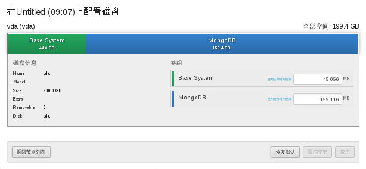
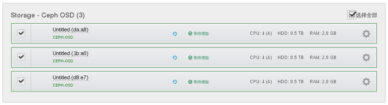
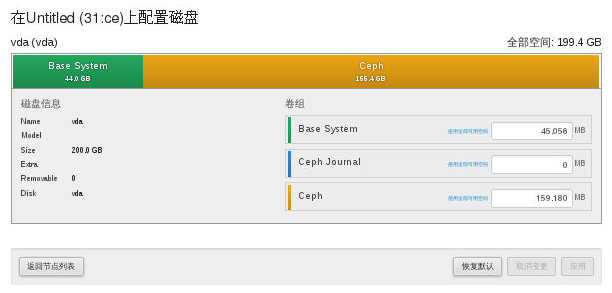

# 配置节点磁盘

发现并增加所有节点后，需要分配各节点的磁盘空间。

## Controller节点

* 勾选全部**Controller节点**，点击**磁盘配置**按钮。

  

* 配置磁盘分区，如下图所示，**无特殊需求建议使用默认分区方案**。

  

## Compute节点

* 勾选全部**Compute节点**，点击**磁盘配置**按钮。

  

* 配置磁盘分区，如下图所示，**无特殊需求建议使用默认分区方案**。

  

## Mongo节点

* 勾选全部**Mongo节点**，点击**磁盘配置**按钮。

  

* 配置磁盘分区，如下图所示，**无特殊需求建议使用默认分区方案**。

  

## Ceph-osd节点

* 勾选全部**Ceph-osd节点**，点击**磁盘配置**按钮。

  

* 配置磁盘分区，如下图所示，**无特殊需求建议使用默认分区方案**。

  
