# 基本配置

在**设置**面板，配置新环境基本配置。

> ######注意
> 以“(*)”标记的选项需要修改。

## 配置OpenStack帐号(*)

* 设置OpenStack环境Dashboard管理员帐号/密码，如下图所示。

 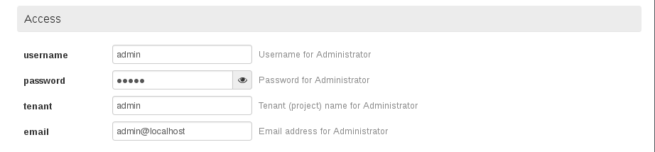

## 配置附加组件

* ***使用默认配置***，EayunStack环境需要选中Ceilometer，如下图所示。

 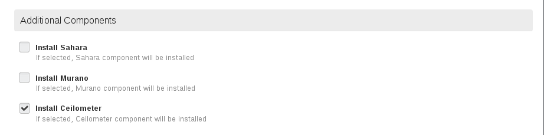

## 通用配置

* ***使用默认配置***，保存OpenStack各服务的Debug消息，如下图所示。

 

* ***使用默认配置***，使用KVM作为底层Hypervisor，如下图所示。

 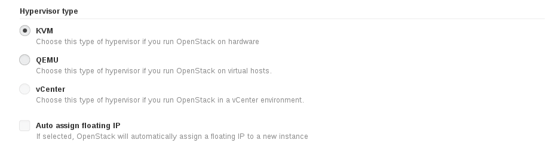

* ***使用默认配置***，调度驱动，如下图所示。

 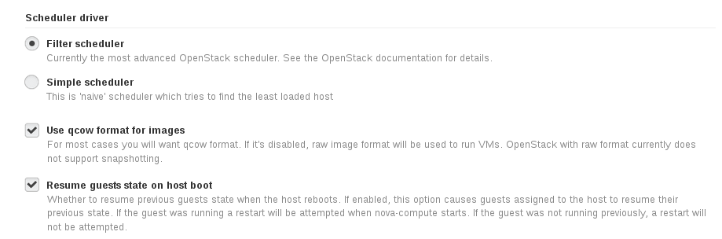

* ***使用默认配置***，添加访问各节点的SSH公钥，如下图所示。

 

* ***使用默认配置***，禁用物理网卡generic offload，如下图所示。

 

## 配置内核参数

* ***使用默认配置***，如下图所示。

 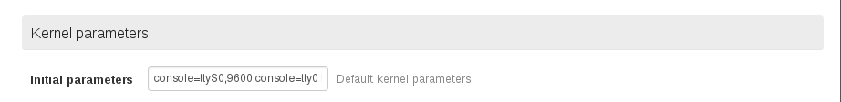

## 配置Mellanox Neutron组件

* ***使用默认配置***，如下图所示

 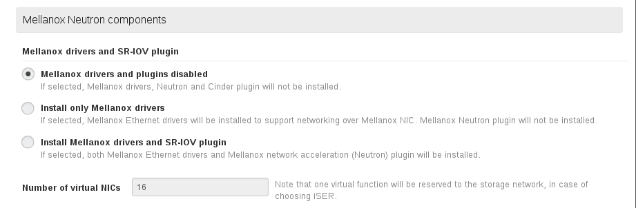

## 配置公网

* ***使用默认配置***，为所有节点分配公网IP地址，如下图所示。

 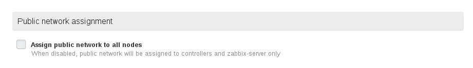

## 配置日志服务器

* ***使用默认配置***，配置日志服务器，将所有OpenStack节点的日志保存到指定日志服务器中，此处配置的日志服务器必须能够接收外部日志，如下图所示。

 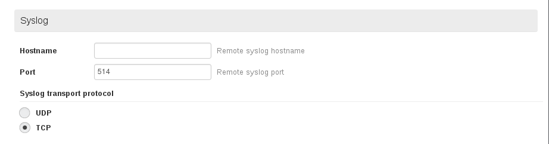

## 配置VLAN

* ***使用默认配置***，如下图所示。

 

## 配置存储

* 配置存储，将"Ceph object replication factor"参数设置为"3"，其它选项使用默认配置,如下图所示。

 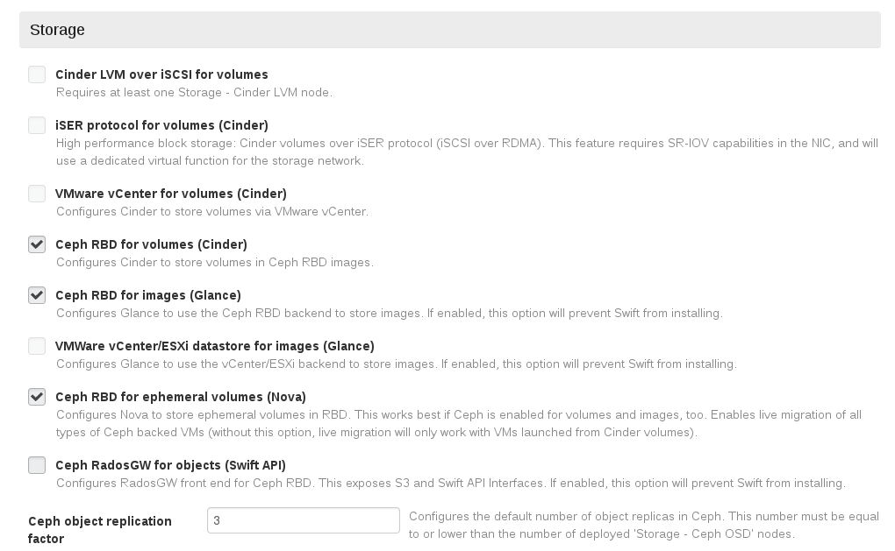

## 配置Neutron LBaaS(*)

 

## 配置Neutron QoS(*)

 
 
## 配置Zabbix

* ***使用默认配置***，配置Zabbix帐号，EayunStack未使用Zabbix，如下图所示。

 
 
## 配置Neutron VPNaaS(*)

 

## 配置Eqlx存储(*)

* 配置Eqlx服务器相关参数，如下图所示。

 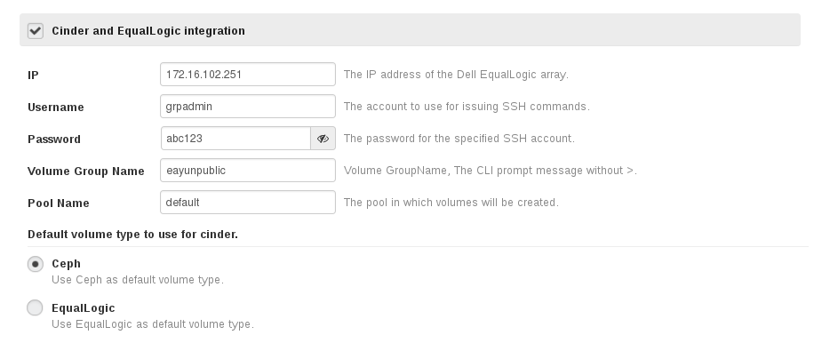
 
## 配置Neutron FWaas(*)

 

## 配置Provision方式

* ***可使用默认配置***，配置OpenStack节点操作系统安装方式，如下图所示。

 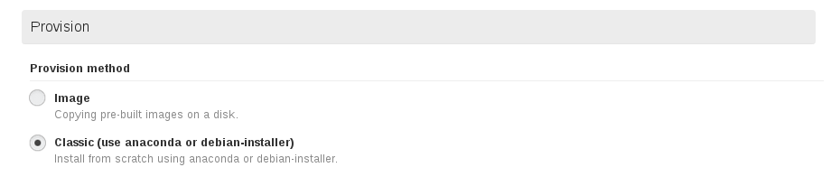

## 配置DNS服务器(*)

* 配置OpenStack节点DNS服务器，可指定多个，以“，”分隔，如下图所示。

 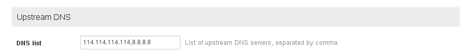

## 配置NTP服务器

* 配置OpenStack节点NTP服务器，可指定多个，以“，”分隔，如下图所示。
 > ###### 注意
 > 此处需要将NTP服务器指向**fuel**节点的PXE网卡所配置的IP地址

 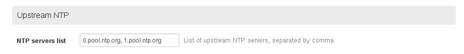

## 保存设置

