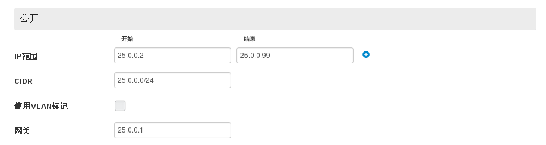
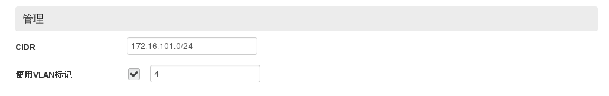
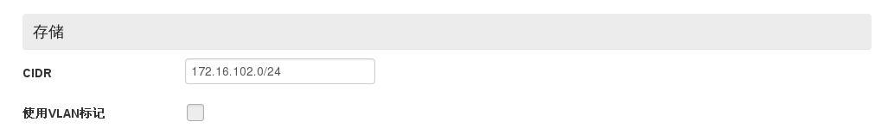
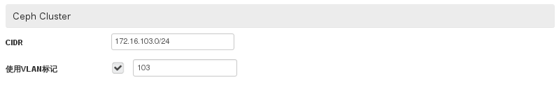
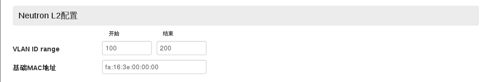
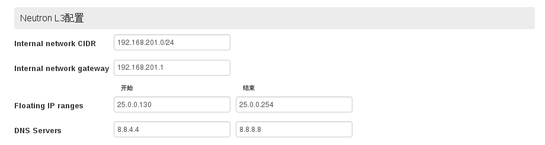
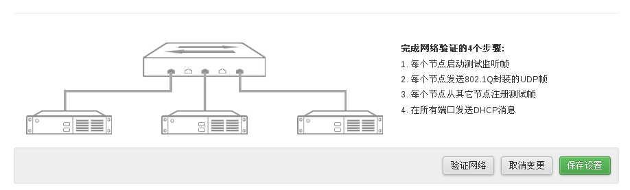

# 网络配置

在**网络**面板，配置新环境网络参数。

## 配置外部网络

* 该网络用于EayunStack环境与外部网络进行通信，如下图所示。

  > ###### 注意
  > 此处所配置网关必须实际存在。

 

## 配置管理网络

* 该网络用于Controller节点与其它节点的通信，如下图所示。

 

## 配置存储网络

* 该网络用于数据通信，如下图所示。

 

## 配置 Ceph Cluster 网络

* 该网络用于 Ceph OSD 节点间进行数据同步，如下图所示。

 

## 配置Neutron数据链路层数

* 配置VLAN ID范围及基础MAC地址，如下图所示。

 

## 配置Neutron网络层参数

* 配置内部网络及浮动IP地址池。

 

## 保存设置

 
