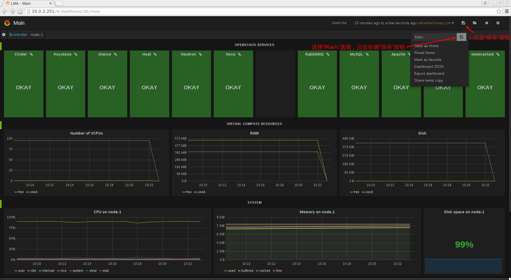

# 平台基本使用及初始化

## 平台基本使用

* 平台部署完成后，我们可以通过浏览器访问 WEB UI 查看平台状态，如下图：

 

* 该界面为监控平台默认主界面（Main），通过该界面我们可以查看平台综合状态，如需查看某个服务或集群的具体状态，可进行如下操作：

 

* 例如查看 Ceph 集群的状态，点击“Ceph”即可，如下图：

 

* 下图所示即为Ceph集群详细状态监控界面：

 

## 平台初始化

从以上例子中我们会发现很多监控界面上某些资源状态为“N/A”或“No datapoints”，这是由于监控界面某些属性默认为空导致的，如“Main”界面左上角“$controller“节点名称，这些属性需要从监控数据中查询获取，我们将查询获取这些属性的过程叫做界面初始化。操作方法如下示例：

* 打开“Templating”设置界面

 

* 点击“Edit”按钮

 

* 查询获取“$controller“属性

 

* 界面初始化完成，此时可以看到“node-1”节点各项监控数据显示正常，此时需要保存初始化操作，如下图所示：

 

* 查看其他节点状态，如下图

 

* 我们需要使用同样的方法，**初始化所有监控界面**，例如“Ceph”界面，如下图所示：

 

* 初始化完成，查看某个节点监控状态

 

